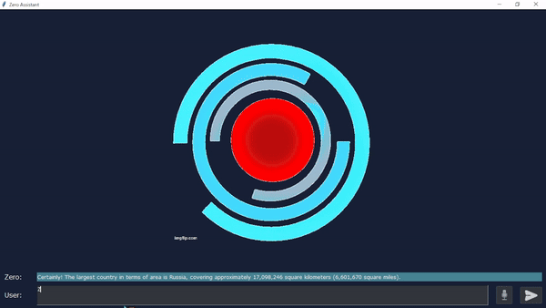

# zero-assistant

This is a basic virtual assistant which you can interact with through text and voice. \
Ask Zero to perform some commands and chat with them.

## Overview

This project presents a virtual assistant with graphical interface (GUI), which interacts with the user through text or speech, using Hugging Face models. \
The environment allows dynamic interactions, having integrated functions which can be activated using natural language.

## Requirements

To be able to use Zero, it's required to have:

- Python (3.10 or higher)
- Hugging Face API token
- Installing the libraries in `requirements.txt` 
- Installing or configuring a Tkinter theme (Go to `themes/readme.txt` for more details)

## Features

- It's capable to interact through text or audio and execute commands
- It uses Tkinter for GUI and [Qwen's Qwen2.5-Coder-32B-Instruct on Hugging Face](https://huggingface.co/Qwen/Qwen2.5-Coder-32B-Instruct) for chatting

## Layout

The layout is composed by an animated image which changes states depending on if Zero is speaking or not, boxes for the user and the assistant, and buttons which provide the options to send a text message or an audio message. It's also possible sending the message by pressing the Enter key.

Below is an example of a chat interaction:

To activate commands, you need to start your text or audio with "Zero," so that she can differentiate your intention.

Here is an example of command activation:

## How to execute the program

In order to execute the project locally, follow the steps below:
1. Clone the repository using `git clone` or download it as a ZIP file
2. (Optional) Create a virtual environment (this project is compatible with [Anaconda environments](https://www.anaconda.com/docs/tools/working-with-conda/environments))
3. Install the libraries listed in the `requirements.txt` file (This can be done through `pip install -r requirements.txt`)
   - If you're using a virtual environment, make sure to install the libraries inside it
4. Create a Hugging Face account and API token (check [documentation](https://huggingface.co/docs/hub/security-tokens) for more info)
5. Create a `.env` file in `chat` folder containing the following line:
   - `HUGGINGFACE_INFERENCE_TOKEN = "<your token here>"`
6. Get a [Google Calendar API](https://developers.google.com/workspace/calendar/api/guides/overview?hl=ja) token and put the `credentials.json` file in the `utils` folder
7. Run the main program (`main.py`)

## Known Issues

Zero requires connection to the internet as both Hugging Face API and TTS/STT libraries need it. As a result, it cannot operate properly when you're offline. \
There are also a few limitations provided by using Tkinter which are expected to be fixed in the later updates.

## Next Steps

Here are a few steps planned to improve Zero's experience:

- Add more commands
- Personalise user experience
- Improve GUI
- Fix performance issues that might occur

## References

1. [Qwen2.5-Coder-32B-Instruct page on Hugging Face](https://huggingface.co/Qwen/Qwen2.5-Coder-32B-Instruct)
2. [thindil's tkBreeze repository](https://github.com/thindil/tkBreeze)

